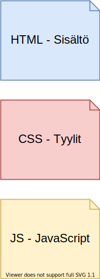

title: Frontti ja backki
author:
  name: Hannu Korhonen
  github: hade
output: esitys.html
controls: true
style: ../asset/cleaver-style.css
--

# Front-end ja Back-end
# Frontti ja backki

--

### Kertausta: Miten Internet toimii
Client ja Server leikissä toinen oli asiakas ja toinen oli palvelin. 

Kukas olikaan asiakas?

--

### Kertausta: Miten Internet toimii
Client ja Server leikissä toinen oli asiakas ja toinen oli palvelin. 

Kukas olikaan asiakas?
- Selain. Tässä tapauksessa Chrome. 

--

### Kertausta: Miten Internet toimii
Client ja Server leikissä toinen oli asiakas ja toinen oli palvelin. 

Mitä asiakas laittoi laatikkoon, kun pyysi palvelusta palvelimelta?

--

### Kertausta: Miten Internet toimii
Client ja Server leikissä toinen oli asiakas ja toinen oli palvelin. 

Mitä asiakas laittoi laatikkoon, kun pyysi palvelusta palvelimelta?
- GET + URL-osoitteen 

--

### Kertausta: Miten Internet toimii
Client ja Server leikissä toinen oli asiakas ja toinen oli palvelin. 

Mitä palvelin laittoi laatikkoon?

--
### Kertausta: Miten Internet toimii
Client ja Server leikissä toinen oli asiakas ja toinen oli palvelin. 

Mitä palvelin laittoi laatikkoon?
- 200/401/404-koodin sekä HTML, CSS, Javascript

--

### HTML, CSS ja Javascript
Näiden ohjelmointia kutsutaan Front-end -ohjelmoinniksi. Se osa, joka näkyy käyttäjälle.

Palvelimen päähän tehtyä koodia kutsutaan Back-end -ohjelmoinniksi.

--

### Muistutus: HTML, CSS ja JS

--

### Kertaus: HTML

Jos vaikka puhutaan sivusta, jolla esitellään eri koirarotuja. Mitä HTML:ssä vois olla?

--

### Kertaus: HTML

Esimerkiksi koirarodut listattuna:
- isovillakoira 
- ruskea labbis

--

### Kertaus: CSS

Mitäs CSS:ssä vois olla?

--

### Kertaus: CSS

- Piirrä tausta vihreällä
- Listaa koirarodut mustalla
- Jätä kunnon välit koirarotujen välille

--

### Kertaus: JS

Mitäs Javascriptissä vois olla?

--

