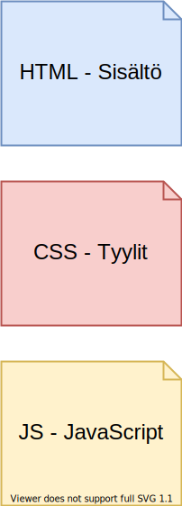

title: HTML - sisältö
author:
  name: Hannu Korhonen
  github: hade
output: esitys.html
controls: true
style: ../asset/cleaver-style.css
--

# HTML - sisältö


--

### HTML



--

### Hyper Text Markup Language

- Merkitsemis-kieli
- Ei perinteistä ohjelmointia
- Luotu alunperin akateemisten tutkimustiedon välittämiseen yliopistojen välille.
- Erilaisia otiskoita, listoja, lihavointeja, kappaleita
- Otetaan iso kasa tekstiä ja merkataan siihen:
	- otsikot
	- kappaleet
	- listat
	- jne.

--

### Pekka-papan julkaisut

https://research.aalto.fi/fi/persons/pekka-korhonen/publications/

Esimerkki:
https://research.aalto.fi/fi/publications/using-convex-preference-cones-in-multiple-criteria-decision-makin

--

### HTML-elementit
Paljon elementtejä käytössä.
- `<h1> `
- `<p> ` 
- `<button> `
- ` ` 
- `<form> `

--

### HTML-elementit
Mikä tämä on?

```<h1>Kahvikupin kohtalo</h1>```

--

### HTML-elementit
Mikä tämä on?

```<h1>Kahvikupin kohtalo</h1>``` 

<span class="green">✔</span> Ylimmän tason otsikko

--

### HTML-elementit
Mikä tämä on?

```<h2>Maito on lopussa</h2>``` 

--

### HTML-elementit
Mikä tämä on?

```<h2>Maito on lopussa</h2>``` 

<span class="green">✔</span> Toisen tason otsikko

--

### HTML-elementit
Mikä tämä on?

```html
<p>Hauki on kala. Hauki on kala. Hauki on kala 
Maito on lopussa</p> 
``` 

--

### HTML-elementit
Mikä tämä on?

```html
<p>Hauki on kala. Hauki on kala. Hauki on kala 
Maito on lopussa</p> 
``` 

<span class="green">✔</span> Kappale

--

### HTML-elementit
Mikä tämä on?

```html
 
``` 

--

### HTML-elementit
Mikä tämä on?

```html
 
``` 

<span class="green">✔</span> Kuva

--

### HTML-elementit
Mikä tämä on?

```html
<form>
	<input type="text" name="first_name">
	<input type="text" name="last_name">
</form>	
``` 

--

### HTML-elementit
Mikä tämä on?

```html
<form>
	<input type="text" name="first_name">
	<input type="text" name="last_name">
</form>	
``` 

 <span class="green">✔</span> Lomake

--

### HTML-elementin alku ja loppu

HTML-elementti aina alkaa ja päättyy johonkin. Kutsutaan tägeiksi. 

- alkutägi
- lopputägi

```html
       
<h1>Otsikko</h1>
```

--
### HTML-elementin alku ja loppu

HTML-elementti aina alkaa ja päättyy johonkin. 

```html
alku       
<h1>Otsikko</h1>
```

--

### HTML-elementin alku ja loppu

HTML-elementti aina alkaa ja päättyy johonkin. 

```html
           loppu        
<h1>Otsikko</h1>
```

--

### HTML-elementin alku ja loppu

HTML:llä voidaan tekstille sanoa:
- "tee tästä kappale"
- "tee tästä lihavoitu"
- "tee tästä otsikko"

